<div align="center">


<h1>CUCEI MART</h1>

<p><strong>Plataforma de E-Commerce Universitario</strong></p>

<p>
  Desarrollado por <strong>NEXCODE</strong><br/>
  Centro Universitario de Ciencias Exactas e Ingenierias (CUCEI) · Universidad de Guadalajara
</p>

---

<p>
  <a href="https://github.com/NEXCODEMX/cuceimart">
    
  </a>
  <a href="https://www.instagram.com/NexCode_MX/">
    
  </a>
  <a href="https://www.youtube.com/@NexCodeMX">
    
  </a>
  <a href="https://nexcodemx.github.io/cuceimart">
    
  </a>
</p>

<p>
  
  
  
  
  
  
</p>

</div>

---

## Descripcion

**CUCEI MART** es una plataforma web de comercio electronico disenada exclusivamente para la comunidad universitaria del CUCEI. Conecta a estudiantes emprendedores con el resto de la comunidad, facilitando la venta de productos y servicios, la visibilidad de proyectos estudiantiles y la economia colaborativa interna.

> El proyecto nacio al identificar que la difusion de emprendimientos dentro del campus se limitaba a grupos de Facebook y WhatsApp sin estructura ni centralizacion. CUCEI MART resuelve esto con una plataforma profesional, segura y eficiente.

---

## Prototipos Visuales

### Pantalla Principal y Navegacion

<div align="center">
  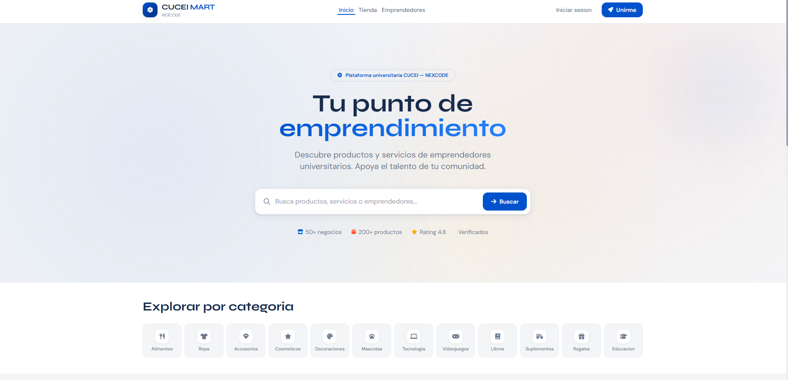
  <br/><sub><b>Pagina Principal de CUCEI MART</b></sub>
</div>

<br/>

<div align="center">
  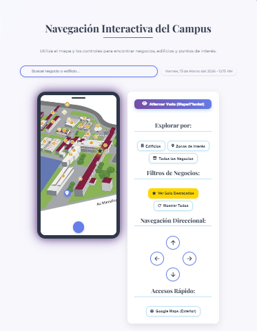
  <br/><sub><b>Navegador Interactivo de la Plataforma</b></sub>
</div>

---

### Autenticacion — Login y Registro

<div align="center">

| Login General | Login Cliente | Login Emprendedor |
|:---:|:---:|:---:|
| 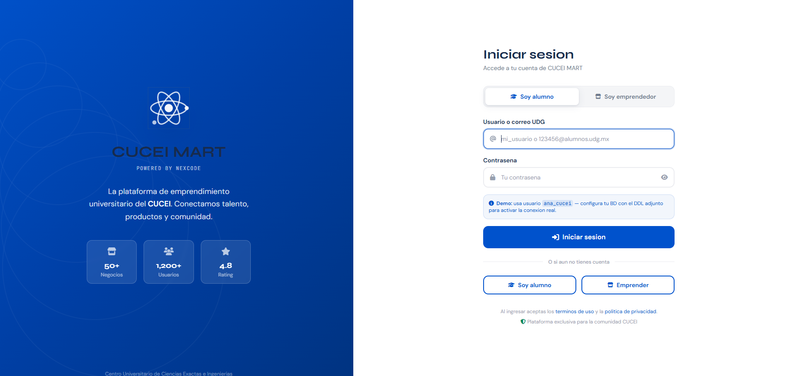 | 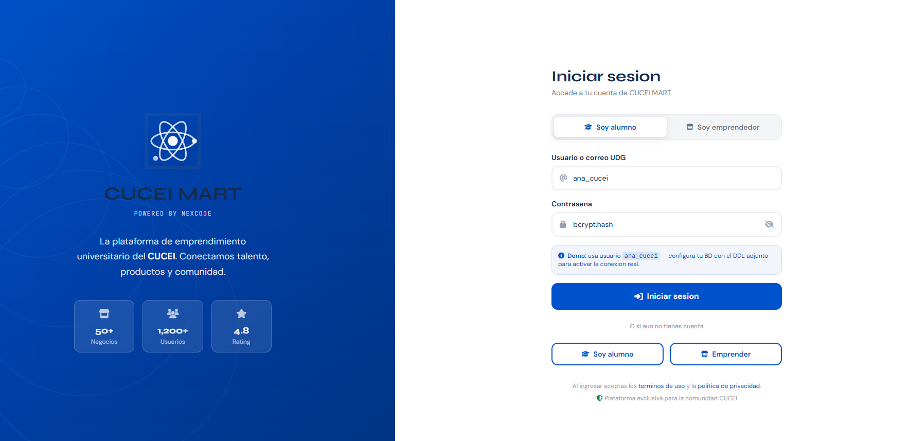 | 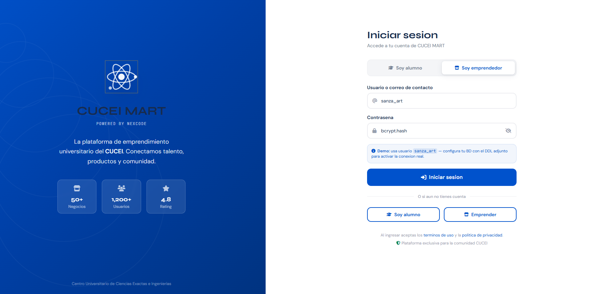 |

| Registro de Alumno | Registro de Negocio | Registro de Emprendimiento |
|:---:|:---:|:---:|
| 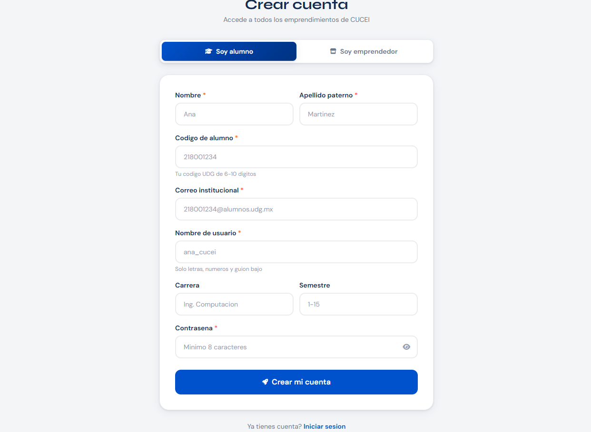 | 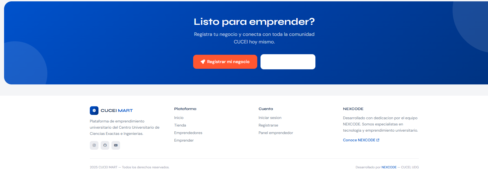 | 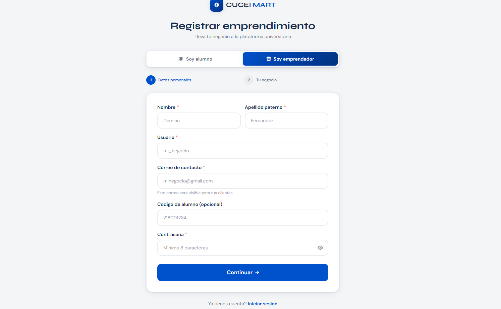 |

</div>

---

### Tienda y Emprendedores

<div align="center">
  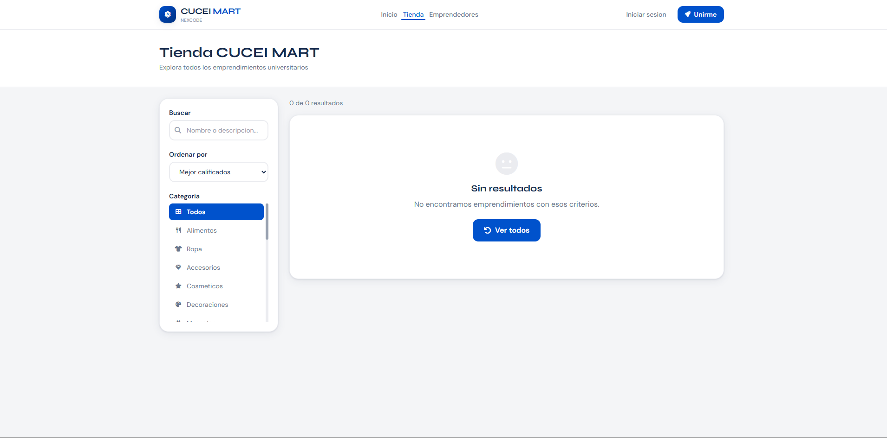
  <br/><sub><b>Catalogo de la Tienda</b></sub>
</div>

<br/>

<div align="center">
  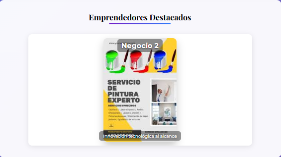
  <br/><sub><b>Banner de Emprendedores Destacados con Rotacion Automatica</b></sub>
</div>

---

### Panel de Emprendedor y Gestion

<div align="center">

| Panel de Novedades | Modulo de Soporte | Casos de Uso |
|:---:|:---:|:---:|
| 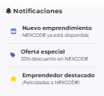 | 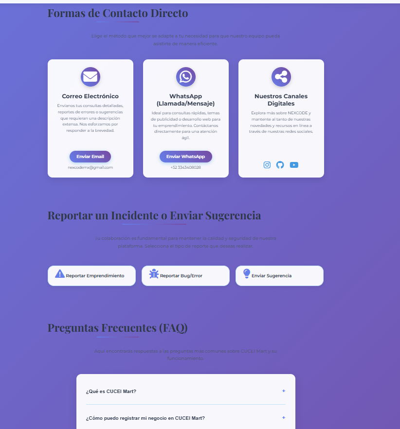 | 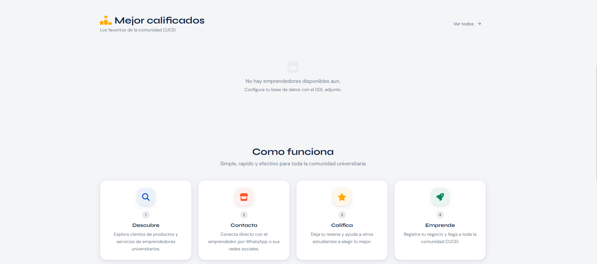 |

</div>

---

### Seccion Institucional

<div align="center">

| Acerca De | Quienes Somos | Nuestros Valores |
|:---:|:---:|:---:|
| 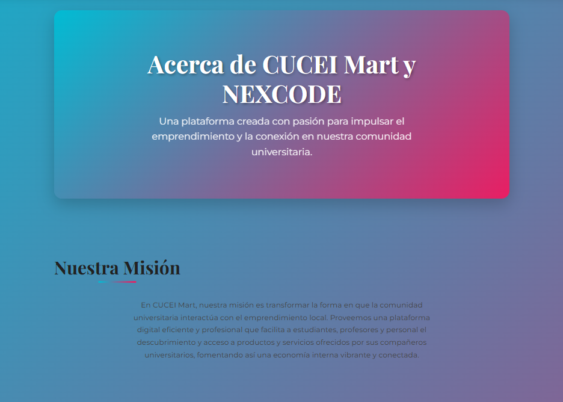 | 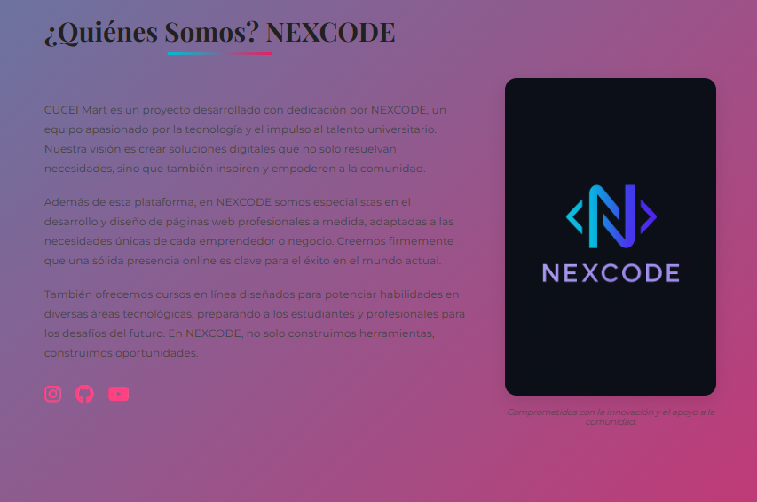 | 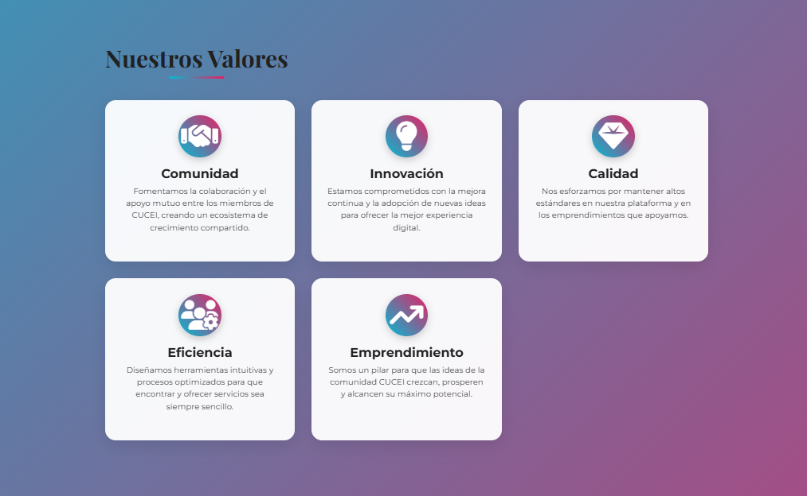 |

</div>

---

### Infraestructura y Tecnologia

<div align="center">

| Base de Datos (DBeaver) | Contenedor Docker | Logo Oficial |
|:---:|:---:|:---:|
|  | 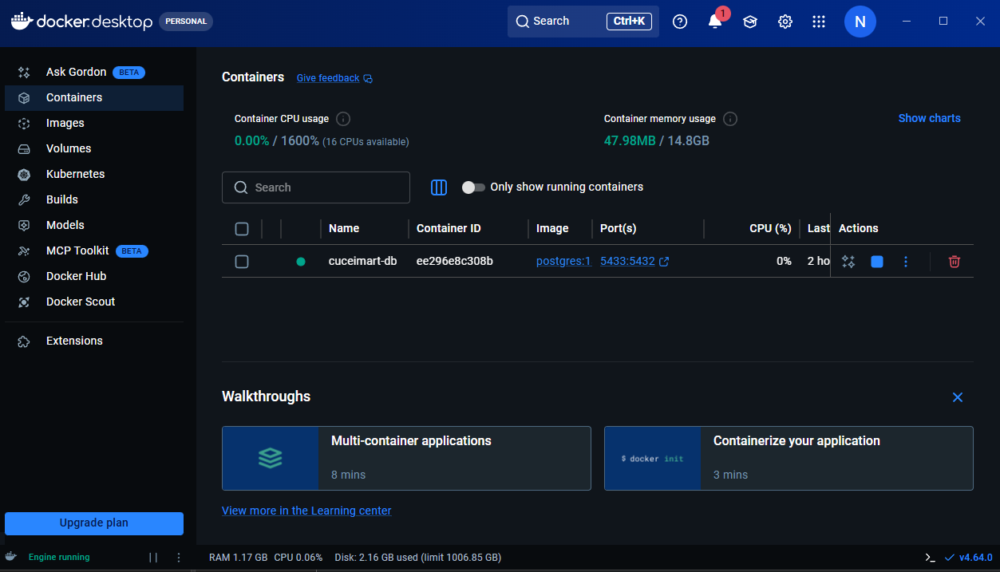 |  |

</div>

---

### Chatbot con Inteligencia Artificial

<div align="center">
  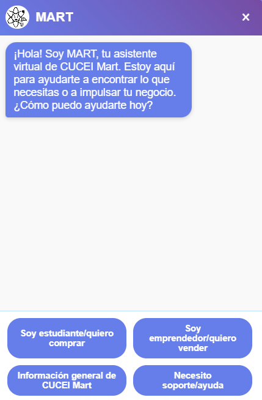
  <br/><sub><b>Chatbot con IA integrado para clientes y emprendedores</b></sub>
</div>

---

## Tecnologias

<div align="center">

### Frontend


### Backend


</div>

---

## Estructura del Proyecto

```
CUCEIMART/
├── backend/
│   ├── src/
│   │   ├── controllers/
│   │   │   ├── authController.js           # Autenticacion JWT (login, registro, refresh)
│   │   │   ├── emprendedoresController.js  # CRUD de emprendedores y resenas
│   │   │   └── productosController.js      # CRUD de productos del catalogo
│   │   ├── db/
│   │   │   └── connection.js               # Pool de conexiones PostgreSQL
│   │   ├── middleware/
│   │   │   └── auth.js                     # Validacion de tokens JWT por rol
│   │   └── routes/
│   │       └── index.js                    # Registro central de todas las rutas
│   ├── .env.example
│   ├── package.json
│   └── server.js                           # Punto de entrada del servidor Express
│
├── frontend/
│   ├── src/
│   │   ├── components/
│   │   │   ├── EmprendedorCard.jsx         # Tarjeta de emprendedor en el catalogo
│   │   │   ├── Navbar.jsx                  # Barra de navegacion responsiva
│   │   │   └── StarRating.jsx              # Componente interactivo de estrellas
│   │   ├── context/
│   │   │   └── AuthContext.jsx             # Estado global de autenticacion
│   │   ├── pages/
│   │   │   ├── EmprendedorDetailPage.jsx   # Vista de perfil de emprendedor
│   │   │   ├── HomePage.jsx                # Pagina principal con banner y busqueda
│   │   │   ├── LoginPage.jsx               # Login diferenciado por rol
│   │   │   ├── PanelEmprendedorPage.jsx    # Dashboard de gestion del emprendedor
│   │   │   ├── RegisterPage.jsx            # Flujo de registro de usuarios
│   │   │   └── TiendaPage.jsx              # Catalogo filtrable de productos
│   │   ├── services/
│   │   │   └── api.js                      # Instancia Axios con interceptores JWT
│   │   ├── styles/
│   │   │   └── globals.css                 # Estilos y variables CSS globales
│   │   ├── utils/
│   │   │   └── helpers.js                  # Funciones de utilidad compartidas
│   │   ├── App.jsx                         # Componente raiz con definicion de rutas
│   │   └── main.jsx                        # Punto de entrada de la aplicacion React
│   ├── index.html
│   ├── package.json
│   ├── tailwind.config.js
│   └── vite.config.js
│
├── RecursosAdicionales/
│   ├── DDLS_BaseDatos/                     # Scripts SQL y DDL de la base de datos
│   ├── Documentacion/                      # Acta constitutiva y documentos de diseno
│   └── PrototiposVisuales/
│       └── imagenes/                       # Capturas de pantalla y prototipos
│
├── cuceimart_DDL_v2.sql                    # DDL completo v2.0 con datos de ejemplo
├── LICENSE                                 # Licencia de Uso Academico No Comercial
└── README.md
```

---

## Guia de Despliegue

### Requisitos Previos

| Herramienta | Version Minima |
|-------------|----------------|
| Node.js | 18.x o superior |
| PostgreSQL | 14.x o superior |
| npm / yarn | Ultima version estable |
| Docker | Opcional, recomendado |

---

### 1. Clonar el Repositorio

```bash
git clone https://github.com/NEXCODEMX/cuceimart.git
cd cuceimart
```

---

### 2. Configurar la Base de Datos

```sql
CREATE DATABASE cuceimart;
```

```bash
# Ejecutar el DDL completo (esquemas, tablas, triggers, datos de ejemplo)
psql -U postgres -d cuceimart -f cuceimart_DDL_v2.sql
```

El script crea automaticamente esquemas (`cuceimart`, `estadisticas`, `media`), extensiones, tipos enumerados, triggers de reputacion y datos de ejemplo listos para pruebas.

---

### 3. Configurar el Backend

```bash
cd backend
npm install
cp .env.example .env
```

```env
PORT=5000
NODE_ENV=development

DB_HOST=localhost
DB_PORT=5432
DB_NAME=cuceimart
DB_USER=cuceimart_admin
DB_PASSWORD=TuPasswordSeguro

JWT_SECRET=tu_secreto_muy_largo_y_seguro_aqui

ALLOWED_ORIGINS=http://localhost:3000,http://localhost:5173
```

```bash
npm run dev

# Verificar respuesta del servidor
curl http://localhost:5000/api/v1/health
```

---

### 4. Configurar el Frontend

```bash
cd frontend
npm install
```

```env
# .env en /frontend
VITE_API_URL=/api/v1
```

```bash
npm run dev
# Disponible en: http://localhost:3000
```

---

### 5. Credenciales de Prueba

| Rol | Usuario | Notas |
|-----|---------|-------|
| Cliente | `ana_cucei` | Generar hash bcrypt antes de usar |
| Emprendedor | `sanza_art` | Generar hash bcrypt antes de usar |

```javascript
// Generar hash en Node.js
const bcrypt = require('bcryptjs');
const hash = await bcrypt.hash('MiContrasena123', 12);
console.log(hash);
```

```sql
UPDATE cuceimart.clientes
SET contrasena_hash = '$2b$12$HASH_GENERADO'
WHERE nombre_usuario = 'ana_cucei';
```

---

## Endpoints Principales de la API

| Metodo | Ruta | Descripcion | Auth |
|--------|------|-------------|------|
| `POST` | `/api/v1/auth/login/cliente` | Login de alumno | No |
| `POST` | `/api/v1/auth/login/emprendedor` | Login de emprendedor | No |
| `POST` | `/api/v1/auth/registro/cliente` | Registro de alumno | No |
| `POST` | `/api/v1/auth/registro/emprendedor` | Registro de emprendedor | No |
| `GET` | `/api/v1/auth/verificar` | Verificar token activo | JWT |
| `GET` | `/api/v1/emprendedores` | Listar emprendedores con filtros | No |
| `GET` | `/api/v1/emprendedores/destacados` | Emprendedores del banner | No |
| `GET` | `/api/v1/emprendedores/:slug` | Perfil publico de emprendedor | No |
| `POST` | `/api/v1/emprendedores/:id/resenas` | Crear resena | Cliente |
| `GET` | `/api/v1/productos` | Listar productos con filtros | No |
| `GET` | `/api/v1/emprendedor/perfil` | Mi perfil de emprendedor | Emprendedor |
| `GET` | `/api/v1/emprendedor/productos` | Mis productos | Emprendedor |
| `POST` | `/api/v1/emprendedor/productos` | Crear producto | Emprendedor |

---

## Funcionalidades

### Implementadas

| Modulo | Descripcion |
|--------|-------------|
| Autenticacion | Login y registro diferenciado por rol con JWT y refresh tokens |
| Busqueda | Filtros por categoria, ordenamiento y texto libre |
| Calificaciones | Sistema de estrellas 1–5 con histograma de distribucion |
| Banner | Emprendedores destacados con rotacion automatica |
| Catalogo | Productos por emprendedor con imagenes y precios |
| Panel | Dashboard de gestion de productos para emprendedores |
| Roles | `superadmin`, `admin`, `emprendedor`, `cliente`, `moderador`, `observador_ia` |
| Seguridad | Rate limiting, Helmet, CORS y bcrypt 12 rounds |
| Base de datos | Triggers automaticos de reputacion y vistas SQL optimizadas |

### Planeadas

| Modulo | Descripcion |
|--------|-------------|
| Chatbot IA | Respuestas automaticas y estadisticas en tiempo real |
| Dashboard | Graficas avanzadas de rendimiento y ventas |
| Notificaciones | Tiempo real con WebSockets |
| Galeria | Gestion de imagenes para productos y perfiles |
| Mapa | Ubicaciones interactivas dentro del campus |
| Pedidos | Modulo completo de ordenes y seguimiento |
| App Movil | Version React Native |
| Administracion | Panel completo para gestores de la plataforma |
| Verificacion | Integracion con correo institucional `@alumnos.udg.mx` |

---

## Seguridad

| Capa | Mecanismo |
|------|-----------|
| Contrasenas | bcrypt con 12 rounds de salting |
| Autenticacion | JWT con expiracion configurable y refresh tokens |
| Rate Limiting | Por IP con Express Rate Limit |
| Headers HTTP | Helmet (HSTS, CSP, XSS Protection) |
| Base de Datos | Usuario de solo lectura para IA (`cuceimart_ia_readonly`) |
| Registro | Validacion de correo institucional `@alumnos.udg.mx` |
| CORS | Lista blanca de origenes configurables por entorno |

---

## Despliegue en Produccion

### Backend — Render Web Service

| Campo | Valor |
|-------|-------|
| Root Directory | `backend` |
| Build Command | `npm install` |
| Start Command | `node server.js` |

Crear un servicio **PostgreSQL** en Render y usar la URL de conexion como variable de entorno.

### Frontend — Vercel (recomendado)

```bash
cd frontend
npx vercel --prod
```

| Campo | Valor |
|-------|-------|
| Root Directory | `frontend` |
| Build Command | `npm install && npm run build` |
| Publish Directory | `dist` |
| Env Variable | `VITE_API_URL` → URL del backend en Render |

---

## Documentacion Tecnica

Todos los documentos se encuentran en `RecursosAdicionales/Documentacion/`:

| Documento | Descripcion |
|-----------|-------------|
| `ActaConstitutivaCUCEIMART.pdf` | Estructura legal, mision, vision y valores del proyecto |
| `DocumentoDiseñoCUCEIMART.pdf` | Arquitectura, requerimientos y diseno del sistema |
| `CUCEIMART_BaseDatos_Manual.docx` | Manual tecnico completo de la base de datos |
| `cuceimart_DDL_v2.sql` | DDL ejecutable de PostgreSQL v2.0 |

---

## Equipo

<div align="center">

Desarrollado por **NEXCODE**

| Rol | Nombre |
|-----|--------|
| Fundador y Desarrollador Principal | Ragknos Demian Fernandez Agraz Rodriguez |

<br/>

<a href="https://github.com/NEXCODEMX">
  
</a>
<a href="https://www.instagram.com/NexCode_MX/">
  
</a>
<a href="https://www.youtube.com/@NexCodeMX">
  
</a>

</div>

---

## Licencia

Este proyecto esta bajo la **Licencia de Uso Academico No Comercial CUCEI MART v1.0**.
Consulta el archivo [LICENSE](./LICENSE) para los terminos completos.

<div align="center">

---

**© 2025–2026 CUCEI MART — NEXCODE**

*Desarrollado para el Centro Universitario de Ciencias Exactas e Ingenierias (CUCEI)*  
*Universidad de Guadalajara*

</div>
